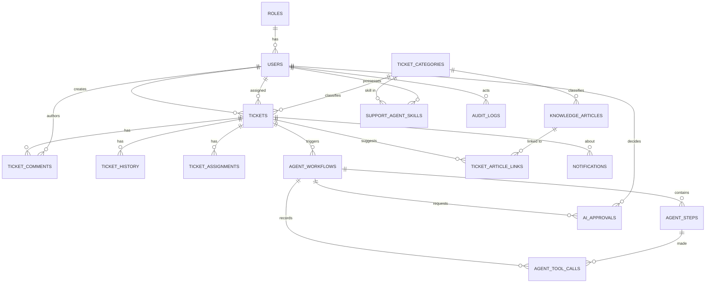

# PostgreSQL Database Design

Provider: **Neon** (serverless PostgreSQL). Access: EF Core 8 + Npgsql. Schema owned by **EF Core migrations**.

## 1. ER diagram

## 2. Tables

| Table | Purpose | Notable columns / constraints |
|---|---|---|
| `Roles` | 4 seeded roles | `Name` UNIQUE (`Employee`,`SupportAgent`,`SupportManager`,`Admin`) |
| `Users` | identity | `Email` UNIQUE (citext-style lower index), `PasswordHash` (BCrypt), `RoleId` FK RESTRICT, `IsActive`, audit fields |
| `TicketCategories` | ticket + article taxonomy | `Name` UNIQUE, `DefaultSlaHours` CHECK > 0 |
| `Tickets` | core entity | `TicketNumber` UNIQUE (`TKT-000123`), `Status`/`Priority` stored as `int` enums with CHECK ranges, `CategoryId` FK, `CreatedByUserId` FK RESTRICT, `AssignedToUserId` FK NULL SET NULL, `SlaDueAt timestamptz`, `ResolvedAt`, `ClosedAt`, `Resolution`, `IsEscalated`, `CreatedAt`, `UpdatedAt` |
| `TicketComments` | discussion | `TicketId` FK CASCADE, `AuthorUserId` FK, `IsInternal bool` (hidden from Employees) |
| `TicketHistory` | §5.4 history | `Field`, `OldValue`, `NewValue`, `ChangedByUserId` NULL (null ⇒ system/agent), `CreatedAt` |
| `TicketAssignments` | assignment audit / reassignment trail | `AssignedToUserId`, `AssignedByUserId` NULL, `Reason`, `Source` (`Manual`\|`AiApproved`) |
| `SupportAgentSkills` | Component B data | UNIQUE(`UserId`,`CategoryId`), `ProficiencyLevel` CHECK 1..5 |
| `KnowledgeArticles` | Component C | `Title`, `Body`, `CategoryId` FK, `Tags text[]`, `IsPublished`, `ViewCount`, `AuthorUserId` |
| `TicketArticleLinks` | AI/manual article suggestions on a ticket | UNIQUE(`TicketId`,`ArticleId`), `Source`, `RelevanceScore` |
| `AgentWorkflows` | §9.6 shared state root | `TicketId` FK, `Objective`, `Status`, `CurrentStep`, `PlanJson jsonb`, `FinalOutcomeJson jsonb`, `ErrorMessage`, `StartedAt`, `CompletedAt` |
| `AgentSteps` | one row per agent execution | `WorkflowId` FK CASCADE, `StepOrder`, `AgentName`, `Status`, `InputJson jsonb`, `OutputJson jsonb`, `ValidationJson jsonb`, `RetryCount`, `DurationMs`, `ErrorMessage` |
| `AgentToolCalls` | §9.9 observability | `ToolName`, `InputJson jsonb`, `OutputJson jsonb`, `Success`, `DurationMs`, `ErrorMessage` |
| `AiApprovals` | §9.8 human gate | `WorkflowId` FK, `TicketId` FK, `ActionType`, `ProposedActionJson jsonb`, `Reason`, `RiskLevel`, `Status` (`Pending`\|`Approved`\|`Rejected`\|`RevisionRequested`), `DecidedByUserId` FK NULL, `DecidedAt`, `DecisionNote` |
| `AuditLogs` | system-wide trail | `EntityType`, `EntityId`, `Action`, `ActorUserId` NULL, `ActorType` (`User`\|`System`\|`Agent`), `DetailsJson jsonb`, `CreatedAt` |
| `Notifications` | third-party send log | `UserId`, `TicketId` NULL, `Channel`, `Subject`, `Status`, `Provider`, `ErrorMessage`, `SentAt` |

16 tables. Each exists because a specific requirement needs it; none is speculative.

## 3. Indexes (chosen, not sprinkled)
- `Users(Email)` unique — login lookup.
- `Tickets(Status)`, `Tickets(Priority)`, `Tickets(AssignedToUserId)`, `Tickets(CreatedByUserId)`, `Tickets(CategoryId)`, `Tickets(SlaDueAt)` — the filter/sort columns exposed by the list API.
- `Tickets(TicketNumber)` unique — search-by-id.
- Composite `Tickets(Status, Priority)` — the dashboard's hottest query.
- `TicketComments(TicketId)`, `TicketHistory(TicketId)`, `TicketAssignments(TicketId)` — detail-page fetches.
- `AgentSteps(WorkflowId, StepOrder)`, `AgentToolCalls(WorkflowId)` — workflow timeline.
- 42 indexes in total once EF Core's automatic foreign-key indexes are included.
- `AiApprovals(Status)` — the Approval Center's "pending" query.
- `AuditLogs(EntityType, EntityId)` and `AuditLogs(CreatedAt DESC)`.
- `KnowledgeArticles(CategoryId)`; free-text search uses `ILIKE` over `Title`/`Body` (documented as adequate at seed scale; a GIN + `pg_trgm` index is the noted upgrade path).

## 4. PostgreSQL-specific choices (viva material)
- `jsonb` for agent plan/output/tool payloads — the shape varies per agent, and `jsonb` lets us query it later without 6 more tables. This is exactly the "database schema strategy for agent workflow state" decision the spec requires an ADR for (ADR-003).
- `text[]` for article tags — avoids a join table for a purely descriptive attribute.
- `timestamptz` everywhere; the app stores UTC.
- Enums stored as `int` with CHECK constraints rather than native PG enums, so EF migrations stay simple and adding a value does not require an `ALTER TYPE`.

## 5. Transactions (§6.4)
The approval-execution path is the one place where several writes must succeed together:
update `Tickets` + insert `TicketHistory` + insert `TicketAssignments` (if assigning) + update `AiApprovals`
+ update `AgentWorkflows` + insert `AuditLogs`. All inside one `BeginTransactionAsync`. A DB integration test
asserts that a forced failure mid-way leaves the ticket unchanged.

## 6. Seed data
4 roles · 8 users (1 admin, 1 manager, 3 support agents, 3 employees) · 6 categories · ~15 skills ·
10 knowledge articles · ~20 tickets across all statuses/priorities including 2 SLA-breaching and
2 SLA-at-risk. Seed passwords come from an env var with a documented dev default, never a committed hash of a real password.

## 7. Data we deliberately do **not** store (§6.5)
Raw LLM prompts, model reasoning/chain-of-thought, API keys, JWTs, plaintext passwords, or full request
bodies. Only structured decision outputs. A unit test asserts the persisted step payloads contain only
the declared schema fields.
